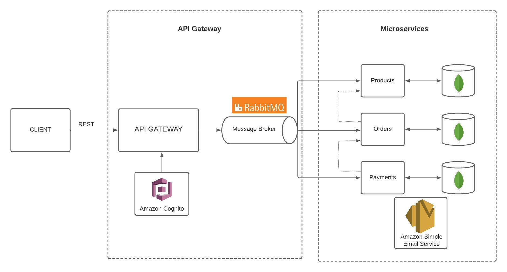

# 🛍️ Ecommerce Microservices Sample

> `Ecommerce Microservices` is a fictional ecommerce sample, built with Node.js and different software architecture and technologies like **Microservices Architecture**,  **NestJS**, **AWS Cloud Services** and **MongoDB**. An API Gateway service was used as an entry point to client requests. For communication between microservices, we used synchronous messaging with RabbitMQ.

💡 The aim of this application is to practice the development of microservices by using different technologies. Therefore,  this application is not business oriented.

## Technologies - Libraries

- **[`NestJS`](https://nestjs.com/)**
- **[`Mongoose`](https://mongoosejs.com/)**
- **[`RabbitMQ`](https://www.rabbitmq.com/)**
- **[`Amazon Cognito`](https://aws.amazon.com/cognito/)**
- **[`Amazon Simple Email Service`](https://aws.amazon.com/ses/)**
- **[`PassportJS`](http://www.passportjs.org)**
- **[`Swagger`](https://swagger.io/)**

## Service Boundary

`ECommerce Microservices` is a simple online ecommerce api sample that has the basic business scenario for online purchasing with some dedicated services. There four possible `Service` or `Bounded context` for above business:

- `API Gateway Service`: The API Gateway acts like an entry point to client requests. It is a REST API which provides users Authorization and Authentication through `Amazon Cognito`. Users needs to register once, then login to receive and access token. All services described below requires an Bearer token to be accessed.

- `Products Service`: The Products Service is responsible for creating, listing and updating Products.

- `Orders Service`: The Orders Service main purpose is to manage orders details created by users on client side. It can create an order based of product ids, list orders and also update order based on the related payment status.

- `Payments Service`: The payment service is responsible for payment process of orders. It is was responsible of updating order status after the payment is processed, and uses `Amazon Simple Email Service` to notify the user regarding payment status.

- `Payment Service`: The payment service is responsible for payment process of our customer with different payment process and managing and tracking our payment history

## Application Architecture

The bellow architecture shows that there is one public REST API (API Gateway) which is accessible for the clients. The API gateway uses a RabbitMQ message broker to communicate with each microservices. Microservices are event based which means they can publish and/or subscribe to any events occurring in the setup. By using this approach for communicating between services, each microservice does not need to know about the other services or handle errors occurred in other microservices. In addition, each microservice has its own MongoDB connection. The communication between microservices is also performed using RabbitMQ message broker.

## How to Run

Starting from root, the project has four main directories (i.e. api-gateway, microservice-products, microservice-orders and microservice-payments). Each of them contains an .env.example file, which must be filled to run the services correctly. Since RabbitMQ and AWS were used, to run this app locally you should create mannualy all features which will be consumed in this app. 

### Running microservices locally
# enter in the microservice directory
$ e.g., cd api-gateway

# install the dependencies
$ npm install

# run the app
$ npm start

# run tests
$ npm test

